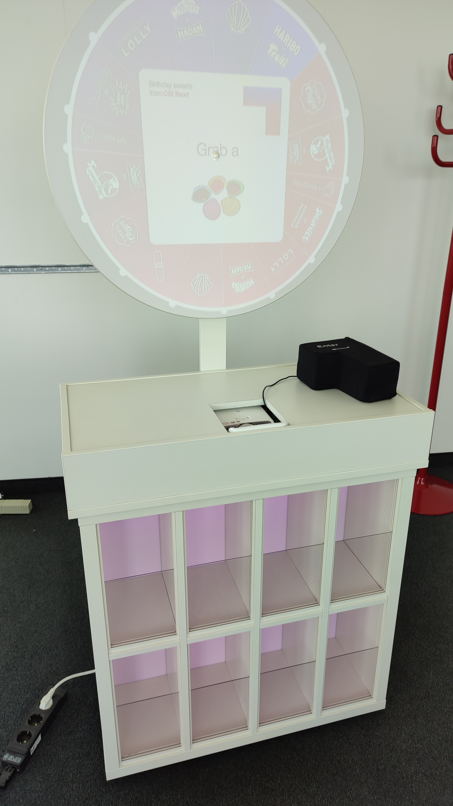
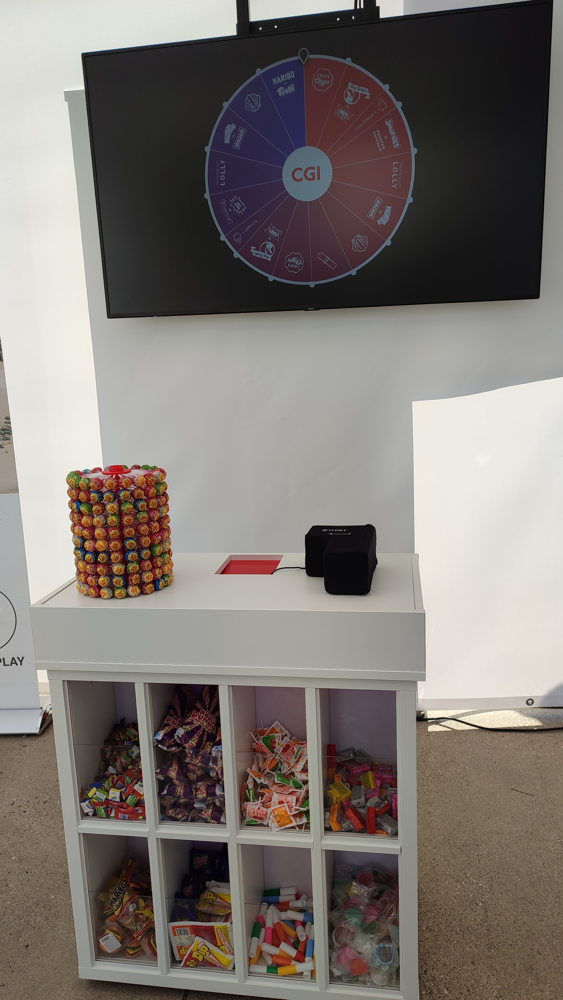
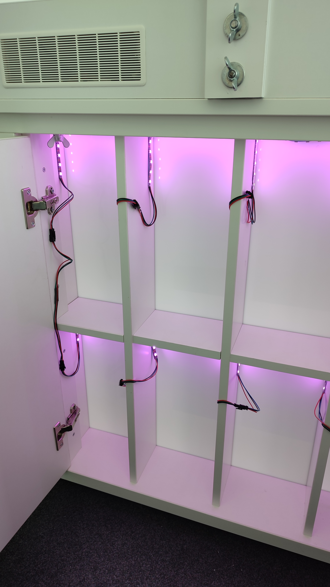

<!-- _footer: "" -->
<!-- _paginate: "" -->
# Design Pattern & Clean Code

## component-based development

###### Thomas Ley | @CleanCodeCoach
---

## Sweets Randomizer

- Wheel of fortune
- Video projection/screen
- One-Button user interface
- Shelves for prices

---

## Adjustable Furniture 

- Box with hardware (main component)
- Projection board (optional)
- Shelves (optional)

---

## Alternative Setups

- Main box with beamer
- Main box+shelves with screen
- Main box with shelves (delocated)
- Shelves with another "game"

---

## Independent Component: Shelves

- USB powered
- Wifi communication
- (open) REST API
- Shelves "as a service" 

---

## Component-based development

- Independent components
- Dependencies are not mandatory
- (default) Interfacecs

---

## the whole thing...

- ... is more than the sum of its parts (Aristoteles)
- Microservices approach
- Small functionality which "just works"
- Business logic just connects functionalities

---

## Design Pattern/Principles

- SRP
- Strategy Pattern
- Null-Object Pattern
- Dependency Injection

---

